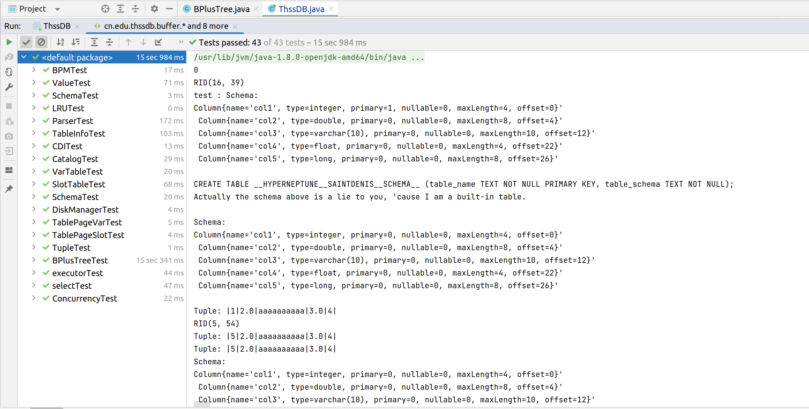
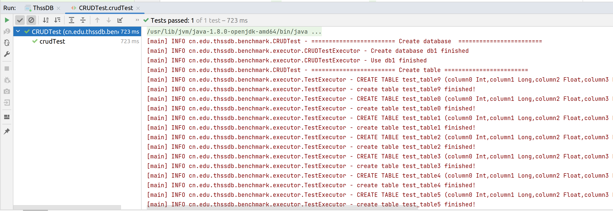
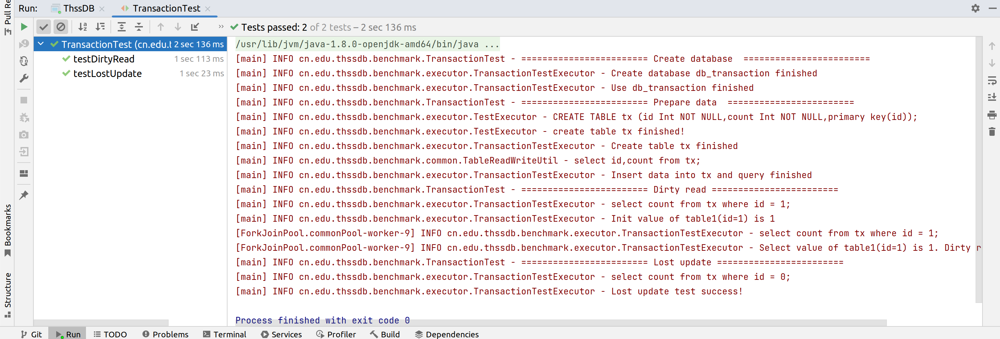
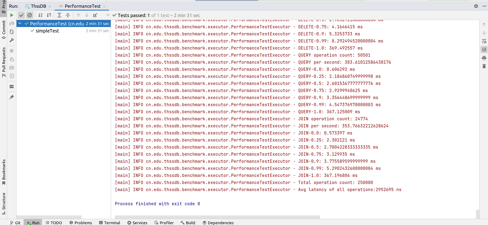

# 数据库原理大作业报告——Neptune

王集 2020012389
贾奕翔 2020012399
幸若凡 2020012365

## 设计哲学
- 解耦合。耦合导致程序无法测试和维护，因为不同作用的代码交织在一起，编程者无法单独调试和重构一个模块的功能。理想情况下，数据库系统应当是 [RISC-style](https://dl.acm.org/doi/10.5555/645926.671696)，系统中每个模块都提供高度分化的 API，和其他模块交互。这样，修改某一模块的代码不会影响到另一个部分的模块，代码的复用性和可维护性提高。
- 开闭原则。向数据库中增加新功能后，不应当影响数据库的原有功能。

## 总体架构
目前，我们的数据库一共有如下模块：
- 类型系统 `cn.edu.thssdb.type`
- 存储系统 `cn.edu.thssdb.storage`
	- 其中还包含索引子系统 `cn.edu.thssdb.storage.index`
- 目录系统 `cn.edu.thssdb.schema`
- 缓存系统 `cn.edu.thssdb.buffer`
- 解析器 `cn.edu.thssdb.parser`
	- 其中还包含绑定器子系统 `cn.edu.thssdb.parser.Binder`
- 执行器 `cn.edu.thssdb.execution`
	- 其中还包含规划器子系统 `cn.edu.thssdb.execution.Planner`
- 事务系统 `cn.edu.thssdb.concurrency`
	- 锁管理器子系统 `cn.edu.thssdb.concurrency.LockManager`
	- 事务管理器子系统 `cn.edu.thssdb.concurrency.TransactionManager`
- 恢复系统 `cn.edu.thssdb.recovery`
  - 日志管理子系统 `cn.edu.thssdb.recovery.LogManager`
  - 日志恢复子系统 `cn.edu.thssdb.recovery.LogRecovery`

图示如下：


## 加分点自评

+ 页式存储
  + 页式存储是一个非常复杂的机制，涉及到数据库系统设计的各个方面。实现这一功能大约使用了大约 3000 行代码（纯代码行数，不含空格、注释，自豪地使用 `cloc` 统计）。
  + 首先，实现一棵分页的 B+ 树，需要在插入的时候正确分裂，在删除的时候正确合并与借用。同时，这棵树还要是并发安全的，其中的数据修改必须保证原子性。这棵树花费了大约 1500 行代码，大量的时间。测试代码还有大约 1000 行。
  + 然后，实现槽页结构，然后再写一个东西把槽页串成一个堆，并且管理这个堆。实现这一部分大约花费了 500 行代码。同时这些东西还要被正确序列化与反序列化。
  + 既然我们的整体结构是分页的，我们的元数据也需要是分页的。这一部分的代码又有约 1000 行。
  + 最后，每个页还有一个 latch，用来保证它们在并发情况下是线程安全的，为了防止死锁和饥饿，这里又有巨大的心智负担。
  + 总之，这是一个复杂至极的高级功能，影响我们整个数据库系统的体系结构，是所有高级功能中最复杂的一个。
+ 缓存池
  + 为了配合页式存储，我们必须写一个缓存池，这一部分本体约 300 行代码，在其他部分的分支大约还有 300 行左右。代码量不大，但是逻辑复杂。数据库的上层从缓存池读取数据都需要经过这个缓存池。
  + 逻辑复杂，是因为缓存池需要对每个页引用计数，来确定这个页能不能被换出。如果一个页的引用计数不等于 0，它是不能被换出的。因此，我需要在每个读入页和写入页的地方做可达性分析，判断这个页的生命周期，然后修改页的引用计数。这些代码的心智负担是极大的。
  + 缓存池支持多种换页算法，包括 LRU 和 FIFO 算法。
+ 可扩展的类型系统
  + 我们包装了数据库中所有的数据类型，这部分大约花费了 1000 行代码和大量的时间。这样做主要基于以下考虑：
  + 用户应当可以引入自己定义的数据类型，只要用户能规定这些数据类型的格式，序列化与反序列化的方式等等。
  + 用户引入自己定义的数据类型不应当影响旧的代码正常工作。
  + 类型之间应该有严格的检查，并且应该有一致的运算符接口。
  + Java 语言原生并不能给我们带来这些好处，所以我们重新包装了 Java 的类型系统。
+ 多表连接
  + 由于我们的查询处理模块本来就是构造一棵迭代器的树，处理多表连接不是特别困难。
+ 多粒度锁
  + 引入了意向锁，使用表锁和行锁两种粒度，一定程度上提高了并发性
+ 多种隔离级别
  + 基本实现了各种隔离级别（Serializable, RepeatableRead, ReadCommitted, ReadUncommitted），其中由于涉及到索引锁并非十分完善，Serializable 和 RepeatableRead 两种级别的区分并不明显。
  + 多粒度锁和多隔离级别都由一个统一的锁管理器管理并组织，使用到的核心技术为互斥锁和条件变量语义，需要在线程安全的条件下维护各种锁的请求队列，并根据相应的逻辑完成线程的休眠、唤醒，完成锁的请求、授予和释放。


## 一条 SQL 语句在 Neptune 中的生和死

让我们从最经典的一条 SQL 语句开始：
```SQL
SELECT name FROM human WHERE age = 1;
```
当用户千辛万苦配置完环境，打开数据库，输入这条指令之后，发生了什么呢？

首先，数据库系统会用 `TransactionManager` 新建一个事务。许多人在同时使用数据库，所以数据库系统需要努力防止人们相互影响。事务正是数据库并发控制的手段。

接着，所有指令被分割为两类：内置指令和 SQL 指令。许多数据库都有独立于 SQL 语法，用于管理数据库系统的指令。例如在 `PostgreSQL` 中，输入 `\dt` 可以获得所有的表。我们这里只是分流了许多只有 0 ～ 1 个参数的小命令，例如展示所有数据库，创建数据库。我们直接执行它们，避免语法解析的代价。

SQL 指令接着来到绑定器。绑定器首先解析这条语句。它调用 `ANTLR 4` 的相关函数访问了语法分析树，构建出一颗由 `Statement, TableBinder, Expression` 组成的 SQL 语句树。这棵树的节点全部都是我们自己新建的，包含执行这条语句所需的上下文信息。

> 为什么需要这棵树？
> 1）SQL 语句中存在递归结构，例如表的 Join 会形成一颗左/右深树，因此需要解析出这棵树。另外，二元表达式也是递归的。
> 2）我们无法提取 `ANTLR 4` 中的语法分析树；为便利自定义内容，最好也还是自己手写一个。

只有上下文信息还不够，因为这些信息此时依然是字符串。我们不可能从一个字符串里查询出任何东西，我们需要数据库中的表。所以，我们要把语句树中的字符串替换为表、列、表达式等等。这一步，`Binder` 和 `Schema` 模块紧密协作，完成绑定工作。

然后，SQL 语句也分流出两个类别：简单 SQL 指令和复杂 SQL 指令。简单 SQL 指令马上执行，下面这四种指令过于复杂，值得优化，因此继续往下走：
```SQL
SELECT
UPDATE
INSERT
DELETE
```

我们使用 `Executor` 执行对数据库的物理操作，例如顺序查询，索引查询，过滤，投影等。每一种 SQL 语句都需要若干 `Executor` 组合起来发挥作用。

例如最普通的 `SELECT` 语句需要三个 `Executor`，最底层的一个顺序扫描一张表，向上输出一系列的元组。中间层收到以后，按照 `WHERE` 中的条件过滤，只输出符合条件的元组给最上层。最上层再投影，筛选出真正需要的属性。

我们用 `Planner` 将 SQL 语句转化为物理执行方案。这也就是上面四种 SQL 语句的最后一站。在这之后，`Planner` 会返回一个 `Executor` 交给 `ExecutionEngine` ，它会"抽干”执行器的所有结果，返回给数据库，数据库再把结果以一定的格式返回给用户。

## 类型系统

我们一共支持六种类型。除了要求的五种 (`int, long, float, double, string`) 之外，还有 `bool` 类型。因为它在数据库内部中非常实用。

数据库支持的所有类型有一组统一的接口 `Type`，数据库中的所有数值也有一组统一的接口 `Value` 。

`Type` 是一个抽象工厂。所有具体类型继承 `Type`，成为具体工厂。然后，`Type` 可以制造出 `Value` 。因为 Type 是一个抽象类，所以并不存在抽象的 `Value`，而 `Value` 只是所有数据共享的一个接口。所有具体数值都继承实现了这个抽象类。

`Type` 主要提供如下功能：

- 序列化和反序列化自身
- 类型转换
- 反序列化 `Value` ( 因为 `Type` 是 `Value` 的工厂 )
- 判断两个类型是否相等
- 获取类型空值

`Value` 主要提供如下功能：
- 序列化和反序列化自身
- 获取类型信息
- 获取自身大小，获取自身在 JAVA 中对应的值。
- 加减乘除模
- 比较和判等

当然，`Type` 可以继续被抽象工厂继承，只要最后能返回一个具体工厂即可。例如，字符串类型就是这样的。字符串类型继承了 `Type`，但是本身依然是一个抽象工厂，因为没有指定字符串长度。指定字符串长度之后，字符串类型才成为一个具体的类型，例如 `VARCHAR(30)`。之后，这个类型可以生产字符串 `Value`。

当然，这些 `Type` 都是单例，因为没有必要有很多个工厂。`Value` 绝不是单例，因为数据是多样的。不过，空值还是单例的。

## 存储系统

### 数据库文件

我们使用单一文件存储所有的数据库信息，通过计算数据库文件的大小来确定数据库文件的页数。我们用一个 `DiskManager` 类管理数据库文件。`DiskManager` 是对 `java.nio` 的一层封装。它提供读写页的接口：
- 读入指定页号的页。
- 将页写入指定的页号位置。

另外，`DiskManager` 还提供了日志的读写功能，在日志恢复模块叙述。

### 元组

数据库中的一行在 `Neptune` 中称为 `Tuple`，中文称为“元组”，对应原来框架中的 `Row`。当新旧代码并存的时候，我们需要更名新的类名，防止和原来框架的重复。

行是组成页的基本单元。它由一个 header 和一个 payload 组成。header 用于存储这一行的元数据，包含三个内容：
- 这一行中存在几个字段
- 每个字段是否为 null (Bitmap)。
- 数据的大小

元组提供以下功能：
- 序列化和反序列化。
- 根据 `Schema` 和列在 `Schema` 中的位置取出一个值。

### 页

我们使用分页机制处理内存和磁盘之间的关系。内存以 `Global.PAGE_SIZE` 为单页大小从磁盘中载入和写入数据。

抽象类 `Page` 用于表示数据库中的页。它的头部含有两个字段，即页号和 `LSN(Log Sequence Number)`。当页面在内存中的时候，它还有额外的两个运行时数据：页面是否脏、页面引用计数。

所有页面共享的头数据如下所示：

| 字段      | 大小      | 描述                  |
|---------|---------|---------------------|
| page_id | 4 bytes | 页号                  |
| LSN     | 4 bytes | Log Sequence Number |

`TablePage` 用于表示数据表页。为了分离策略和机制，它是一个接口。`TablePage` 只需要支持如下功能：
- 获得这张表下一页和前一页的 ID
- 设置上一张表和下一张表 ID
- 根据 schema 获得一个 Tuple
- 更新删除和插入 Tuple。
- 迭代器

默认提供一个最简单的 `TablePage` 实现，称作 `TablePageSlot`，这个页的结构如下：

| 字段                 | 大小      | 描述            |
|--------------------|---------|---------------|
| prev_page_id       | 4 bytes | 上一页号          |
| next_page_id       | 4 bytes | 下一页号          |
| free_space_pointer | 4 bytes | 空闲空间指针        |
| tuple_count        | 4 bytes | tuple 数量      |
| tuple_length       | 4 bytes | tuple 长度      |
| bitmap             | 不定      | 位图，表示槽位是否已经分配 |
| free space         | 不定      | 自由空间          |

这个页只支持固定长度的 tuple，所以我们在页的 header 放置了 tuple_length 字段，用于表示 tuple 的长度。在头后面是一个动态增长位图数据结构，用来表示在这一页中，哪些空位(slot)被占用，哪些空位因为数据删除而空闲。

因为这一位图从低地址向高地址增长，所以新的 tuple 需要从高地址向低地址增长，以避免碰撞。当位图和 tuple 重叠的时候，这一页就满了。

除了 `TablePageSlot` ，我们还提供了另外一种页面的实现，`TablePageVar`。这个页面可以存放可变长度的记录。不过这个页面目前只用于存储元数据，还没有向用户开放。它的结构与 `TablePageSlot` 相仿。但是，因为元组的大小可变，我们必须增加一些元数据，表达元组的位置和大小，因为它们无法直接计算出来。

| 字段                   | 大小       | 描述        |
|----------------------|----------|-----------|
| prev_page_id         | 4 bytes  | 上一页号      |
| next_page_id         | 4 bytes  | 下一页号      |
| free_space_pointer   | 4 bytes  | 空闲空间指针    |
| slot_count           | 4 bytes  | 槽位数量      |
| tuple_count          | 4 bytes  | tuple 数量  |
| (槽位开始位置，槽位大小，槽位状态集合) | 12 bytes | 和槽位相关的元数据 |
| free space           | 不定       | 自由空间      |

这个页面在插入数据的时候动态分配槽位。删除槽位的元组以后，槽位为空。空槽位可以复用来存储小于等于它的数据。一经复用，槽位的大小会缩小到元组的大小。于是，外部碎片产生。许多数据库系统使用 `VACUMM` 机制解决这个问题，但它非常复杂，我们不打算实现它。

### 索引

索引当然也是分页的。我们使用晚物化 ( Late Materialization )模型，`B+ Tree` 索引只存储 `RID`，不存储实际的数据。

B+ 树索引页共享的元数据如下:

| 字段       | 大小      | 描述            |
|----------|---------|---------------|
| pageType | 4 bytes | 内部节点页还是叶子节点页？ |
| size     | 4 bytes | 页面中键值对的数量     |
| maxSize  | 4 bytes | 页面中键值对的最大数量   |
| parentId | 4 bytes | 父页的 ID        |

内部页存储有序的 m 个 key 和 m + 1 个指针。指针其实就是子页的 `PageID`，在查找的时候，通过这个 ID 找到子页。

叶子页存储有序的 m 个 key 和 m 个 `Value`，由于我们采用晚物化模型，叶子页的 `Value` 实际上是 `PageID + SlotID`。

这篇文档中不再赘述 `B+ Tree` 的相关算法。

我们会为每一个表以主键建立索引，并且用索引来维护 `Primary Key` 的性质。

### 表

为了把数据表的各个页串联起来，我们新建了一个类 `SlotTable` 来管理由 `TablePageSlot` 组成的表。这个类的实质只是一个页面的双向链表。因为页面的具体存储格式是多样的，表也可以是多样的，因此我们规定了一个统一的接口 `Table`，避免上层 API 与表的具体实现相关联。

表提供如下功能：
- 插入
- 删除
- 更新
- 获取第一页的 ID
- 查询
- 迭代器

## 缓存系统

我们使用 `BufferPoolManager` 管理内存缓存。它提供如下功能：
- 按照 `PageID` 从磁盘/内存获取页面
- 新建页面
- 刷洗页面（将页面从内存写入磁盘）
- 换页

当数据内存超过缓存大小之后，`BufferPoolManager` 会以一定策略淘汰一部分页面，然后载入新的页面。为了支持多种替换算法，我们用了策略设计模式，注入了 `ReplaceAlgorithm` 这一依赖。这个接口沟通 `BufferPoolManager` 和具体的换页算法。

默认的换页算法是 `LRU` 算法。

我们在缓存系统中使用引用计数和闩 ( latch ) 控制并发。闩用来保护公用数据结构，而引用计数用于防止页在被读写的时候替换。

数据库的执行/存储部分均不和 `DiskManager` 接触，而是和 `BufferPoolManager` 交互。在数据库关机的时候，数据全部刷洗到磁盘上。

## 目录系统（元数据模块）

### 列

作为 `OLTP` 数据库，我们毫无疑问是行式存储的。因此，行是我们存储的基本单位，而列信息是我们的元数据。

我们的列由以下几个字段组成，变长字段之间用逗号隔开，非变长字段排列在一起：

| 字段            | 大小      |
|---------------|---------|
| 列名            | 变长      |
| 列类型           | 变长      |
| 是否为主键         | 1 bytes |
| 是否可空          | 1 bytes |
| 最大长度          | 4 bytes |
| 在 Tuple 中的偏移量 | 4 bytes |

列还有一个运行时的属性，称为全名 `fullname`，它是这个列带上表名，或者被更名之后的名称。

### 方案 Schema

将所有的列拼接在一起，成为数据表的 Schema。Schema 用于描述数据表的整体结构，开头为一个 `colsNum`，表示这个 Schema 由几列组成。然后是一系列的列信息，他们中间用分号隔开。

| 字段   | 大小       |
|------|----------|
| 列数   | 4 bytes  |
| 每一个列 | 变长，用分号隔开 |

当我们解读数据库行信息的时候，我们利用 Schema 来获得每个字段的类型，从而获得每个字段的值。具体说，Schema 会用列的名字在自己持有的所有列中比对，找到正确的列，然后 `Tuple` 类会使用这个列的信息来取出一个值。另外，在全名可用的情况下，Schema 会优先按照全名匹配，在不可用的时候再使用默认的列名。

最后，逗号和分号在 SQL 中都是保留字，所以我们不用担心列名和类型中出现逗号和分号的情况。

### 表信息 TableInfo

`TableInfo` 用于存储数据表的一切元数据。它包含以下字段：

| 字段        | 大小      |
|-----------|---------|
| 表名长度      | 4 bytes |
| 表名        | 变长      |
| 表的 Schema | 变长      |
| 表第一页页号    | 4 bytes |
| 索引第一页页号   | 4 bytes |

在运行的时候，数据库会用表第一页的页号构造出 `Table` ，用索引的第一页页号构造出`Index`，供执行器使用。

### 目录 Catalog

Catalog 用于管理数据库中所有的表的信息，也就是所有的 `TableInfo`。它支持：
- 从数据库文件中读取所有的表的信息
- 把表的信息写入数据库文件
- 列出所有的表信息
- 根据表名获得表的信息
- 创建表
- 删除表

它管理一个特殊的表，它的表名是 `__HYPERNEPTUNE__SAINTDENIS__SCHEMA__` ，Schema 中只有一个很长的 `VARCHAR` ，用来存储表的 `TableInfo`。因为这个字符串是变长的，所以只能使用变长表和变长的页面。

### 无辜者公墓 CimetiereDesInnocents

无辜者公墓，`CimetiereDesInnocents`，是我们数据库系统中用于管理所有 `Catalog` 的类。也是数据库在 `Bootstrap(自举)` 阶段的关键。

无辜者公墓管理元神表(`MetaKamiTable`)，这个表非常普通，其中只有两列，一个 `VARCHAR` 对应数据库的名称，一个 `int` 对应数据库 `Catalog` 第一页的 `PageId`，有了这两个信息，就可以遍历整个元神表，然后构造出数据库中所有的元信息。

无辜者公墓在数据库启动的时候构造出来，然后它会根据数据库启动的选项，或者创建一个新的元神表，或者读取一个已经存在的元神表。

无辜者公墓提供以下功能：
- 创建一个新的无辜者公墓
- 打开一个文件，读取其中的内容，然后返回一个无辜者公墓
- 创建数据库
- 删除数据库
- 查询数据库
- 列出所有数据库

## 解析 & 查询系统

### 语法解析

通过 `ANTLR4` 的语法分析树，一条 `SQL` 语句被解析为一个 Statement，并且绑定了数据库对象。下面列举 Statement 的种类，并说明它们的作用。

- CREATE_TABLE,
	- 创建表语句。包含信息：所有的列信息、表的名称。
- DROP_TABLE,
	- 删除表语句。包含信息：表的名称。
- SHOW_TABLE,
	- 展示表语句。包含信息：表的 `TableInfo`。
- INSERT,
	- 插入语句。包含信息：表的 `TableInfo`，要插入的所有 `Tuple` 的数组。
- DELETE,
	- 删除语句。包含信息：表的 `TableInfo`，删除所需满足的条件 `Expression`
- UPDATE,
	- 更新语句。包含信息：表的 `TableInfo`，更新的值，更新需要满足的条件
- SELECT
	- 查询语句。包含信息：表的组合 `TableBinder`，是否去重，投影列表，过滤器的谓词。

当我们处理 `ON`,  `WHERE`, `SELECT` 的时候，需要构建一棵表达式树。我们一共有四种表达式：

- BINARY
	- 二元表达式，支持各种各样的二元运算符。
- CONSTANT
	- 常量表达式，放置解析出来的数值，字符串等常量。
- UNARY
	- 一元表达式，目前还没有用。
- COLUMN_REF
	- 列引用表达式，代表引用数据库中，一个列的值。

因为表可以 `JOIN` ，因此表也需要被表示为一棵树。我们的 `TableBinder` 一共有这几种：

- JOIN
	- 连接绑定。成员：左 `TableBinder`，右 `TableBinder`，Join 条件
- REGULAR
	- 普通表。一般是叶子节点。成员：一个 `TableInfo`
- CROSS
	- 笛卡尔积。成员：左 `TableBinder`，右 `TableBinder`
- EMPTY
	- 空。在没有表的情况下，`SELECT` 只可以用来做计算器。

总之，语法分析模块会返回一颗以 `Statement` 为根，其中混杂 `Expression` 和 `TableBinder` 的树。

### 查询系统

查询处理模块仅仅处理四种复杂的 SQL 语句。因为其他的 SQL 语句不需要处理就可以直接执行。这四种语句分别为：

```SQL
SELECT
UPDATE
INSERT
DELETE
```

查询处理模块采用火山模型 (`volcano model`)，也就是迭代器模型。根部的执行器调用子执行器的 `next()` 函数，然后子执行器再调用自己的子执行器的 `next()`，以此类推，最后再把结果一层层向上返回，最后交给用户。我们会用 `Planner` 遍历一次从语法分析中获得的 `Statement`，然后组装出一个 `Executor` 组成的树，返回它根部的 `Executor` 给用户。

我们一共有以下几种基本 `Executor`:

- `deleteExecutor`，用来删除一条记录。
- `filterExecutor`，不断从下层抽取记录，直到满足条件，或者 `EOF`。
- `indexScanExecutor`，扫描数据库索引，按照向上层提供记录。
- `insertExecutor`，用来插入一条记录。
- `nestedLoopJoinExecutor`，用来连接两张表。
- `projectionExecutor`，用来投影，去除查询中不需要的属性。
- `seqScanExecutor`，顺序扫描一张表，向上层提供记录。
- `updateExecutor`，用来更新一条记录。

对于部分算子，我们使用了索引进行优化，这些 `Executor` 如下，它们显著地提高了执行的速度：

+ `indexScanExecutor`
+ `indexUpdateExecutor`
+ `indexDeleteExecutor`
+ `indexJoinExecutor`

每个 `Executor` 中都包含一个 `ExecContext`，其中包含本次查询相关的上下文信息，例如这次查询归属的事务，缓存池管理器以及总目录等等。

最后，`Executor` 交由 `ExecutionEngine`，它会不断调用根执行器的 `next()` 方法，把结果保存到一个数组里，直到根执行器枯竭。

当结果完整、正确地送到用户手中的时候，这条 SQL 语句就终结了自己的历史使命。其中包含着各种各样精巧的设计：并发控制、查询优化、数据组织…… 为了构建可扩展、可维护和可靠的软件系统，数据库系统设计者孜孜不倦，绞尽脑汁。正所谓：“桃李春风一杯酒，江湖夜雨十年灯”。

## 事务系统（并发控制模块）

### 锁管理器 LockManager

当数据库中出现若干个事务并行执行时，为了保持隔离性，我们使用了基于锁的协议对并发进行控制。我们使用了两阶段封锁协议（two-phase locking protocol）以保证事务的可串行化。我们实现了 4 种事务的隔离级别：串行、可重复读、读提交、读未提交。除此之外，为了提高事务的并发性，我们引入了意向锁（intention lock）以细化锁的粒度。

首先介绍我们使用的锁的种类及相容性矩阵

|         | **IS** | **IX** | **S** | **SIX** | **X** |
| ------- | ------ | ------ | ----- | ------- | ----- |
| **IS**  | T      | T      | T     | T       | F     |
| **IX**  | T      | T      | F     | F       | F     |
| **S**   | T      | F      | T     | F       | F     |
| **SIX** | T      | F      | F     | F       | F     |
| **X**   | F      | F      | F     | F       | F     |

我们的锁操作分为两个粒度：表锁和行锁。行锁是较细粒度的的锁，位于锁树的子节点，对行进行封锁需要先对表进行意向封锁。

具体的实现较为繁琐，这里只以获取表锁的操作举例简要介绍其实现原理，我们区分事务锁（lock）和线程锁（latch），前者由 LockManager 管理，后者由 jvm 与操作系统管理。LockManager 维护一个从数据库表到锁请求队列的 HashMap 映射，接受到一个事务的上锁请求后，首先根据事务的阶段进行逻辑检查，接着查询 HashMap 以区分该请求是否属于锁升级，最后将请求正式加入队列并等待授予锁。线程安全性主要通过 java 中的可重入锁（ReentrantLock）和相应的条件变量语义实现。

以下是我们对不同隔离级别的事务的锁的校验原则，由于串行只需要单个锁即可实现，故不在此考虑范围中

| 获取锁                 | 可重复读 REPEATABLE_READ | 读提交 READ_COMMITTED | 读未提交 READ_UNCOMMITTED |
|---------------------|----------------------|--------------------|-----------------------|
| 需求                  | All                  | All                | Only IX, X            |
| 允许（Growing Stage）   | All                  | All                | Only IX, X            |
| 允许（Shrinking Stage） | None                 | Only IS, S         | Only IX, X            |

可以看出，只有可重复读在获取锁的时候需要严格遵守 2PL 协议。

| 释放锁 | 可重复读 REPEATABLE_READ | 读提交 READ_COMMITTED | 读未提交 READ_UNCOMMITTED |
|-----|----------------------|--------------------|-----------------------|
| 释放X | to Shrinking         | to Shrinking       | to Shrinking          |
| 释放S | to Shrinking         | -                  | UB                    |

对于读未提交的事务，释放S锁是未定义行为，我们将直接中止该事务。

### 事务管理器 TransactionManager

事务管理器管理一切事务，见证着、掌控着所有事务的诞生和凋亡。

单个事务内部主要维护以下数据

| 字段      | 类型                | 描述                                  |
|---------|-------------------|-------------------------------------|
| id      | int               | 事务序列号，由事务管理器统一分配                    |
| t id    | long              | 事务所在的线程序号                           |
| p lsn   | int               | 事务最后一次被日志记录的日志序列号                   |
| state   | TransactionState  | 事务的阶段（Growing、Shrinking、Committed等） |
| i level | IsolationLevel    | 事务的隔离级别                             |
| ... set | HashMap / HashSet | 四个集合，分别记录事务S和X的表锁和行锁获取情况            |
| w set   | ArrayList         | 事务的所有写操作                            |

事务管理器对事务的管理主要包含以下五种方法

+ Begin：
  + 开始一个事务，同时开始记录下日志和事务的所有写操作
+ Abort：
  + 中止一个事务，释放事务获取的所有的锁，并回滚事务的所有写操作
+ Commit：
  + 提交一个事务，释放事务获取的所有的锁
+ BlockAll：
  + 暂停所有事务，以创建存档点
+ ResumeAll：
  + 恢复所有的事务

## **恢复系统**

### 日志管理器 LogManager

日志管理器负责生成日志，并将日志持久化存储，使用了 DiskManager 作为文件读写的接口。使用了先写日志（WAL）的方案。日志文件和数据库文件在同一目录中，但后缀名为 `.log`。

我们将日志记录划分为五种：事务日志、插入日志、删除日志、更新日志、页日志。以下分别是这五种日志的记录结构。

#### 事务日志

事务日志使用的字段最少，且其他 4 种日志均有着和事务日志相同的头部结构。故可将事务日志作为统一的日志头（Header）

| 字段       | 大小      | 描述               |
|----------|---------|------------------|
| size     | 4 bytes | 日志段大小，用于反序列化时使用  |
| LSN      | 4 bytes | 日志序列号            |
| txn ID   | 4 bytes | 事务号              |
| prev LSN | 4 bytes | 事务的 p lsn（见事务字段） |
| type     | 4 bytes | 日志类别（例如这里是事务日志）  |

#### 插入/删除日志

元组的插入和删除操作会产生这种日志。这两种日志虽然类别不同，但结构相似。其中 Header 包含 5 个字段，和事务日志中的 5 个字段一致。

| 字段         | 大小       | 描述            |
|------------|----------|---------------|
| Header     | 20 bytes | 见事务日志         |
| tuple RID  | 8 bytes  | 插入/删除的元组的 RID |
| tuple size | 4 bytes  | 插入/删除的元组的大小   |
| tuple data | 变长       | 插入/删除的元组的具体数据 |

#### 更新日志

元组的更新会产生这种日志。

| 字段             | 大小       | 描述         |
|----------------|----------|------------|
| Header         | 20 bytes | 见事务日志      |
| tuple RID      | 8 bytes  | 更新的元组的 RID |
| old tuple size | 4 bytes  | 旧元组的大小     |
| old tuple data | 变长       | 旧元组的具体数据   |
| new tuple size | 4 bytes  | 新元组的大小     |
| new tuple data | 变长       | 新元组的具体数据   |

#### 页日志

新建页会产生这种日志。

| 字段           | 大小       | 描述      |
|--------------|----------|---------|
| Header       | 20 bytes | 见事务日志   |
| prev page id | 4 bytes  | 前一页的页序号 |
| page id      | 4 bytes  | 新建的页序号  |


### 日志恢复器 LogRecovery

日志恢复器可以将数据库日志反序列化，除此之外，日志恢复器还提供了两个重要的接口：重做（Redo）和撤销（Undo）。重做操作将重新完成事务的行为，撤销操作将回滚事务的行为。

我们的恢复过程将分为两个阶段执行：重做阶段和撤销阶段。在这两个阶段之前，还需要对日志文件中的数据进行反序列化以得到具体的日志对象。

+ **重做阶段**：正向扫描，重演事务的更新
  + 对正常日志执行重做
  + 将事务开始日志加入撤销列表
  + 将事务中止/事务提交日志从撤销列表中删除
+ **撤销阶段**：从尾端开始反向扫描，回滚事务
  + 将遇到位于撤销列表中的日志记录进行撤销
  + 将遇到位于撤销列表中的事务开始日志从撤销列表中移除，并写入事务中止日志


## 测试报告

1. 我们自己写的单元测试，一共 43 个。



2. CRUDTest 正常通过



3. ConcurrencyTest 正常通过


4. TransactionTest 正常通过



5. PerformanceTest 正常通过

耗时两分半。



结果如下
```
[main] INFO cn.edu.thssdb.benchmark.executor.PerformanceTestExecutor - Finish performance test after 150327 ms
[main] INFO cn.edu.thssdb.benchmark.executor.PerformanceTestExecutor - INSERT operation count: 124658
[main] INFO cn.edu.thssdb.benchmark.executor.PerformanceTestExecutor - INSERT per second: 323.1281834440046
[main] INFO cn.edu.thssdb.benchmark.executor.PerformanceTestExecutor - INSERT-0.0: 0.574863 ms
[main] INFO cn.edu.thssdb.benchmark.executor.PerformanceTestExecutor - INSERT-0.25: 2.626437591796875 ms
[main] INFO cn.edu.thssdb.benchmark.executor.PerformanceTestExecutor - INSERT-0.5: 2.9684104416666663 ms
[main] INFO cn.edu.thssdb.benchmark.executor.PerformanceTestExecutor - INSERT-0.75: 3.461942936303516 ms
[main] INFO cn.edu.thssdb.benchmark.executor.PerformanceTestExecutor - INSERT-0.9: 4.043742222222222 ms
[main] INFO cn.edu.thssdb.benchmark.executor.PerformanceTestExecutor - INSERT-0.99: 5.333209840000001 ms
[main] INFO cn.edu.thssdb.benchmark.executor.PerformanceTestExecutor - INSERT-1.0: 367.735631 ms
[main] INFO cn.edu.thssdb.benchmark.executor.PerformanceTestExecutor - UPDATE operation count: 25090
[main] INFO cn.edu.thssdb.benchmark.executor.PerformanceTestExecutor - UPDATE per second: 385.27056632989996
[main] INFO cn.edu.thssdb.benchmark.executor.PerformanceTestExecutor - UPDATE-0.0: 0.565994 ms
[main] INFO cn.edu.thssdb.benchmark.executor.PerformanceTestExecutor - UPDATE-0.25: 2.1535604583333336 ms
[main] INFO cn.edu.thssdb.benchmark.executor.PerformanceTestExecutor - UPDATE-0.5: 2.5804212888888896 ms
[main] INFO cn.edu.thssdb.benchmark.executor.PerformanceTestExecutor - UPDATE-0.75: 2.91859175 ms
[main] INFO cn.edu.thssdb.benchmark.executor.PerformanceTestExecutor - UPDATE-0.9: 3.3944575 ms
[main] INFO cn.edu.thssdb.benchmark.executor.PerformanceTestExecutor - UPDATE-0.99: 4.948181500000003 ms
[main] INFO cn.edu.thssdb.benchmark.executor.PerformanceTestExecutor - UPDATE-1.0: 14.591791 ms
[main] INFO cn.edu.thssdb.benchmark.executor.PerformanceTestExecutor - DELETE operation count: 24977
[main] INFO cn.edu.thssdb.benchmark.executor.PerformanceTestExecutor - DELETE per second: 291.8215714178591
[main] INFO cn.edu.thssdb.benchmark.executor.PerformanceTestExecutor - DELETE-0.0: 0.594279 ms
[main] INFO cn.edu.thssdb.benchmark.executor.PerformanceTestExecutor - DELETE-0.25: 2.3760089138888887 ms
[main] INFO cn.edu.thssdb.benchmark.executor.PerformanceTestExecutor - DELETE-0.5: 2.9652721666666664 ms
[main] INFO cn.edu.thssdb.benchmark.executor.PerformanceTestExecutor - DELETE-0.75: 4.1646415 ms
[main] INFO cn.edu.thssdb.benchmark.executor.PerformanceTestExecutor - DELETE-0.9: 5.3253733 ms
[main] INFO cn.edu.thssdb.benchmark.executor.PerformanceTestExecutor - DELETE-0.99: 8.292494520000004 ms
[main] INFO cn.edu.thssdb.benchmark.executor.PerformanceTestExecutor - DELETE-1.0: 369.492557 ms
[main] INFO cn.edu.thssdb.benchmark.executor.PerformanceTestExecutor - QUERY operation count: 50501
[main] INFO cn.edu.thssdb.benchmark.executor.PerformanceTestExecutor - QUERY per second: 383.61012586438176
[main] INFO cn.edu.thssdb.benchmark.executor.PerformanceTestExecutor - QUERY-0.0: 0.606292 ms
[main] INFO cn.edu.thssdb.benchmark.executor.PerformanceTestExecutor - QUERY-0.25: 2.184860749999998 ms
[main] INFO cn.edu.thssdb.benchmark.executor.PerformanceTestExecutor - QUERY-0.5: 2.6015367777777776 ms
[main] INFO cn.edu.thssdb.benchmark.executor.PerformanceTestExecutor - QUERY-0.75: 2.9299940625 ms
[main] INFO cn.edu.thssdb.benchmark.executor.PerformanceTestExecutor - QUERY-0.9: 3.356448699999999 ms
[main] INFO cn.edu.thssdb.benchmark.executor.PerformanceTestExecutor - QUERY-0.99: 4.547376970000003 ms
[main] INFO cn.edu.thssdb.benchmark.executor.PerformanceTestExecutor - QUERY-1.0: 367.125009 ms
[main] INFO cn.edu.thssdb.benchmark.executor.PerformanceTestExecutor - JOIN operation count: 24774
[main] INFO cn.edu.thssdb.benchmark.executor.PerformanceTestExecutor - JOIN per second: 353.76632212628624
[main] INFO cn.edu.thssdb.benchmark.executor.PerformanceTestExecutor - JOIN-0.0: 0.573397 ms
[main] INFO cn.edu.thssdb.benchmark.executor.PerformanceTestExecutor - JOIN-0.25: 2.302121 ms
[main] INFO cn.edu.thssdb.benchmark.executor.PerformanceTestExecutor - JOIN-0.5: 2.7004228333333335 ms
[main] INFO cn.edu.thssdb.benchmark.executor.PerformanceTestExecutor - JOIN-0.75: 3.129935 ms
[main] INFO cn.edu.thssdb.benchmark.executor.PerformanceTestExecutor - JOIN-0.9: 3.775589599999999 ms
[main] INFO cn.edu.thssdb.benchmark.executor.PerformanceTestExecutor - JOIN-0.99: 5.2902432600000004 ms
[main] INFO cn.edu.thssdb.benchmark.executor.PerformanceTestExecutor - JOIN-1.0: 367.196806 ms
[main] INFO cn.edu.thssdb.benchmark.executor.PerformanceTestExecutor - Total operation count: 250000
[main] INFO cn.edu.thssdb.benchmark.executor.PerformanceTestExecutor - Avg latency of all operations:2952695 ns

Process finished with exit code 0

```